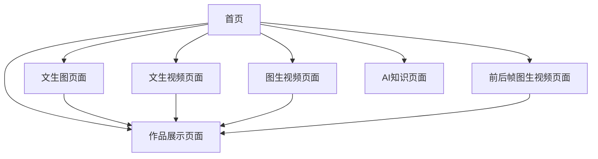

# AI绘画启蒙网页产品需求文档

## 1. 产品概述
一个专为小学生设计的AI绘画启蒙网页，通过文生图、文生视频、图生视频、前后帧图生视频等功能，让孩子们体验AI创作的魅力。
产品旨在激发小学生对人工智能技术的兴趣，培养创造力和想象力，通过简单易懂的交互方式让孩子们了解AI技术的应用。
目标是成为小学生AI启蒙教育的优质平台，帮助孩子们在游戏中学习，在创作中成长。

## 2. 核心功能

### 2.1 用户角色
| 角色 | 注册方式 | 核心权限 |
|------|----------|----------|
| 小学生用户 | 无需注册，直接使用 | 可使用所有AI创作功能，查看作品展示 |

### 2.2 功能模块
我们的AI绘画启蒙网页包含以下主要页面：
1. **首页**：欢迎界面、功能导航、精选作品展示
2. **文生图页面**：文字描述生成图片功能
3. **文生视频页面**：文字描述生成短视频功能
4. **图生视频页面**：上传图片生成动态视频
5. **前后帧图生视频页面**：上传两张图片生成过渡动画
6. **作品展示页面**：展示用户创作的作品集合
7. **AI知识页面**：简单介绍AI绘画原理和应用

### 2.3 页面详情
| 页面名称 | 模块名称 | 功能描述 |
|----------|----------|----------|
| 首页 | 欢迎区域 | 显示卡通风格的欢迎标语和AI机器人形象 |
| 首页 | 功能导航 | 四个大按钮分别对应四种AI创作功能 |
| 首页 | 精选展示 | 轮播展示优秀的AI创作作品 |
| 文生图页面 | 文字输入区 | 提供文本框和预设提示词选择 |
| 文生图页面 | 图片生成区 | 显示生成的图片和下载保存功能 |
| 文生图页面 | 参数调节区 | 简化的风格选择（卡通、写实、水彩等） |
| 文生视频页面 | 描述输入区 | 文本输入框和视频时长选择 |
| 文生视频页面 | 视频预览区 | 生成视频的播放和下载功能 |
| 图生视频页面 | 图片上传区 | 拖拽上传图片和预览功能 |
| 图生视频页面 | 动效选择区 | 预设动画效果选择（缩放、旋转、飘动等） |
| 前后帧图生视频页面 | 双图上传区 | 上传起始帧和结束帧图片 |
| 前后帧图生视频页面 | 过渡设置区 | 选择过渡时间和动画曲线 |
| 作品展示页面 | 作品网格 | 网格布局展示所有创作作品 |
| 作品展示页面 | 分类筛选 | 按创作类型筛选作品 |
| AI知识页面 | 知识卡片 | 图文并茂介绍AI绘画基本概念 |
| AI知识页面 | 互动问答 | 简单的AI知识小测试 |

## 3. 核心流程
用户首先进入首页，通过功能导航选择感兴趣的AI创作功能。在文生图流程中，用户输入描述文字或选择预设提示词，系统生成对应图片；在文生视频流程中，用户输入描述并选择时长，生成短视频；在图生视频流程中，用户上传图片并选择动效，生成动态视频；在前后帧图生视频流程中，用户上传两张图片设置过渡参数，生成过渡动画。所有创作完成的作品都会保存到作品展示页面供用户查看和管理。

## 4. 用户界面设计
### 4.1 设计风格
- 主色调：明亮的蓝色(#4A90E2)和温暖的橙色(#F5A623)
- 辅助色：柔和的绿色(#7ED321)和粉色(#FF6B9D)
- 按钮风格：圆角矩形，带有轻微阴影和悬停动效
- 字体：使用易读的无衬线字体，标题18-24px，正文14-16px
- 布局风格：卡片式设计，顶部导航栏，响应式网格布局
- 图标风格：使用可爱的卡通风格图标和emoji表情

### 4.2 页面设计概览
| 页面名称 | 模块名称 | UI元素 |
|----------|----------|--------|
| 首页 | 欢迎区域 | 渐变背景，卡通AI机器人插图，大标题使用彩色字体 |
| 首页 | 功能导航 | 四个大型卡片按钮，每个配有图标和简短说明 |
| 文生图页面 | 文字输入区 | 圆角文本框，预设提示词标签按钮，彩色边框 |
| 文生图页面 | 图片生成区 | 加载动画，图片展示框，下载按钮带图标 |
| 文生视频页面 | 视频预览区 | 视频播放器，进度条，播放控制按钮 |
| 图生视频页面 | 图片上传区 | 虚线边框拖拽区域，上传图标，预览缩略图 |
| 作品展示页面 | 作品网格 | 瀑布流布局，悬停放大效果，作品信息标签 |
| AI知识页面 | 知识卡片 | 卡片式布局，插图配文字，渐变背景色 |

### 4.3 响应式设计
产品采用移动优先的响应式设计，支持桌面端、平板和手机端访问，针对触屏设备优化交